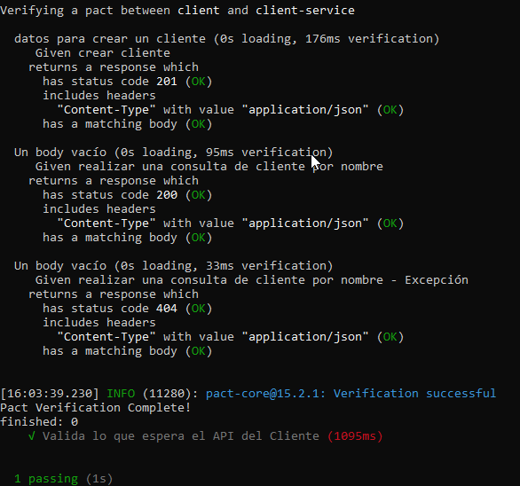

Aplicar el taller de Contract testing al Caso de Estudio del Proyecto Final de manera que se pueda generar pruebas de integración en cada microservicio. No necesita estar completo, lo importante es que tiene que haber un avance que permita reflejar que se está comprendiendo los conceptos y su aplicación. Como herramientas utilizar Pact en cualquiera de sus versiones. Tiene que haber al menos dos solicitudes realizadas desde el consumidor y estar verificada desde el provider para poder tomar la actividad como completada.

Se realizo 3 solicitudes desde el consumidor y se verifico desde el provider. Para crear el cliente y obtener por nombre del cliente, asi como tambien realizar una excepcion si el cliente no existe por nombre.

